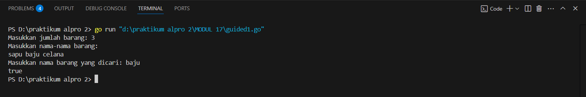
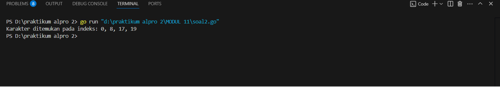
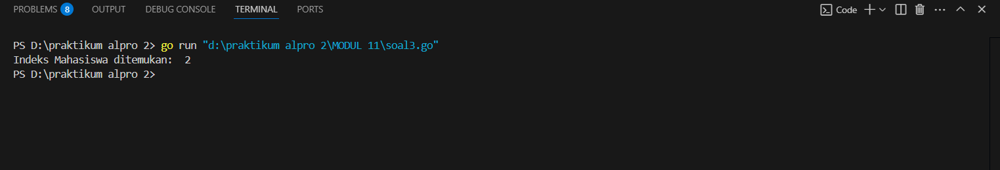
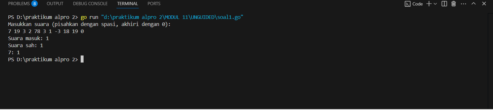
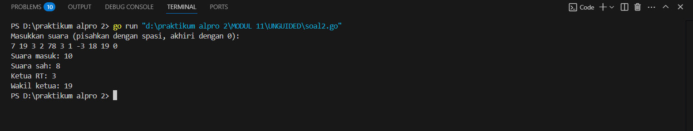

<h1 align="center" > Laporan Praktikum Modul  4 X PENCARIAN NILAI ACAK PADA HIMPUAN DATA</h1>

<p align="center ">Satria Adhi Sadarma - 103112400273<p/>
## Soal latihan modul 11


<h1 align="center" > GUIDED</h1>


```go
1. package main

  

import "fmt"

  

func cariBarang(daftar []string, x string) bool {

    for _, barang := range daftar {

        if barang == x {

            return true

        }

    }

    return false

}

  

func main() {

    var n int

    fmt.Print("Masukkan jumlah barang: ")

    fmt.Scan(&n)

  

    daftarBarang := make([]string, n)

    fmt.Println("Masukkan nama-nama barang:")

    for i := 0; i < n; i++ {

        fmt.Scan(&daftarBarang[i])

    }

  

    var barangDicari string

    fmt.Print("Masukkan nama barang yang dicari: ")

    fmt.Scan(&barangDicari)

  

    ditemukan := cariBarang(daftarBarang, barangDicari)

    fmt.Println(ditemukan)

}

```

output


```go
2. package main

  

import "fmt"

  

func seqSearch(kalimat string, karakter byte) []int {

    var posisi []int

    for i := 0; i < len(kalimat); i++ {

        if kalimat[i] == karakter {

            posisi = append(posisi, i)

        }

    }

    return posisi

}

  

func main() {

    var kalimat string

    var karakter rune

  

    kalimat = "algoritma pemrograman"

    karakter = 'a'

    posisi := seqSearch(kalimat, byte(karakter))

  

    if len(posisi) > 0 {

        fmt.Print("Karakter ditemukan pada indeks: ")

        for i := 0; i < len(posisi); i++ {

            fmt.Print(posisi[i])

            if i != len(posisi)-1 {

                fmt.Print(", ")

            }

        }

    } else {

        fmt.Println("Karakter tidak ditemukan.")

    }

}
```

output



```go
3. package main

  

import "fmt"

  

type Mahasiswa struct {

    NIM  string

    Nama string

}

  

func binarySearch(mahasiswa []Mahasiswa, target string) int {

    left := 0

    right := len(mahasiswa) - 1

  

    for left <= right {

        mid := left + (right-left)/2

        if mahasiswa[mid].NIM == target {

            return mid

        }

  

        if mahasiswa[mid].NIM > target {

            right = mid - 1

        } else {

            left = mid + 1

        }

    }

    return -1

}

  

func main() {

    mahasiswa := []Mahasiswa{

        {Nama: "Andi", NIM: "220001"},

        {Nama: "Budi", NIM: "220002"},

        {Nama: "Citra", NIM: "220003"},

        {Nama: "Dina", NIM: "220004"},

    }

  

    x := "220003"

  

    index := binarySearch(mahasiswa, x)

  

    if index != -1 {

        fmt.Println("Indeks Mahasiswa ditemukan: ",index)

    } else {

        fmt.Println("NIM tidak ditemukan.")

    }

}
```




<h1 align="center" > UNGUIDED</h1>
```go
1. package main

  

import (

    "fmt"

    "strings"

)

  

func main() {

    var input string

    fmt.Println("Masukkan suara (pisahkan dengan spasi, akhiri dengan 0):")

    fmt.Scanln(&input)

  

    suara := strings.Split(input, " ")

    suaraMasuk := 0

    suaraSah := 0

  

    perolehan := make(map[int]int)

  

    for _, s := range suara {

        var nilai int

        fmt.Sscanf(s, "%d", &nilai)

  

        if nilai == 0 {

            break

        }

  

        suaraMasuk++

  

        if nilai >= 1 && nilai <= 20 {

            suaraSah++

            perolehan[nilai]++

        }

    }

  

    fmt.Printf("Suara masuk: %d\n", suaraMasuk)

    fmt.Printf("Suara sah: %d\n", suaraSah)

    for i := 1; i <= 20; i++ {

        if perolehan[i] > 0 {

            fmt.Printf("%d: %d\n", i, perolehan[i])

        }

    }

}
```

output


```go
2. package main

  

import (

    "bufio"

    "fmt"

    "os"

    "sort"

    "strconv"

    "strings"

)

  

type Calon struct {

    Nomor int

    Suara int

}

  

func main() {

    fmt.Println("Masukkan suara (pisahkan dengan spasi, akhiri dengan 0):")

  

    reader := bufio.NewReader(os.Stdin)

    input, _ := reader.ReadString('\n')

    input = strings.TrimSpace(input)

  

    tokens := strings.Fields(input)

    suaraMasuk := 0

    suaraSah := 0

    perolehan := make(map[int]int)

  

    for _, token := range tokens {

        nilai, err := strconv.Atoi(token)

        if err != nil {

            continue

        }

        if nilai == 0 {

            break

        }

        suaraMasuk++

        if nilai >= 1 && nilai <= 20 {

            suaraSah++

            perolehan[nilai]++

        }

    }

  

    fmt.Printf("Suara masuk: %d\n", suaraMasuk)

    fmt.Printf("Suara sah: %d\n", suaraSah)

  

    // konversi map ke slice dan urutkan

    var hasil []Calon

    for nomor, suara := range perolehan {

        hasil = append(hasil, Calon{Nomor: nomor, Suara: suara})

    }

    sort.Slice(hasil, func(i, j int) bool {

        if hasil[i].Suara == hasil[j].Suara {

            return hasil[i].Nomor < hasil[j].Nomor

        }

        return hasil[i].Suara > hasil[j].Suara

    })

  

    if len(hasil) > 0 {

        fmt.Printf("Ketua RT: %d\n", hasil[0].Nomor)

    }

    if len(hasil) > 1 {

        fmt.Printf("Wakil ketua: %d\n", hasil[1].Nomor)

    }

}
```

output


```go
3. package main

  

import (

    "fmt"

)

  

const NMAX = 1000000

var data [NMAX]int

  

func main() {

    var n, k int

    fmt.Scan(&n, &k)

    isiArray(n)

  

    pos := posisi(n, k)

    if pos != -1 {

        fmt.Println(pos)

    } else {

        fmt.Println("TIDAK ADA")

    }

}

  

func isiArray(n int) {

    for i := 0; i < n; i++ {

        fmt.Scan(&data[i])

    }

}

  

func posisi(n, k int) int {

    // Binary search untuk efisiensi karena data terurut

    low := 0

    high := n - 1

  

    for low <= high {

        mid := (low + high) / 2

        if data[mid] == k {

            return mid

        } else if data[mid] < k {

            low = mid + 1

        } else {

            high = mid - 1

        }

    }

    return -1

}
```

output

