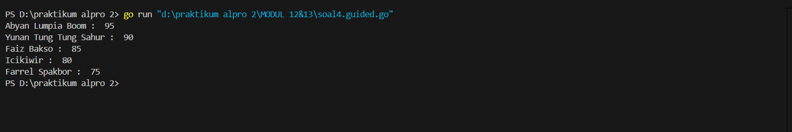

<h1 align="center" > Laporan Praktikum Modul  12&13 X PENGURUTAN DATA</h1>


<p align="center ">Satria Adhi Sadarma - 103112400273<p/>
## Soal latihan modul 12&13

<h1 align="center" > GUIDED</h1>

```go
1. package main

  

import "fmt"

  

func insertionSort(arr []int, panjang int) {

    var temp, i, j int

  

    for i = 1; i < panjang; i++ {

        temp = arr[i]

        j = i

  

        for j > 0 && temp > arr[j-1] {

            arr[j] = arr[j-1]

            j--

        }

  

        arr[j] = temp

    }

}

  

// Example usage

func main() {

    numbers := []int{29, 10, 14, 37, 13}

    insertionSort(numbers, len(numbers))

    fmt.Println("Sorted (descending):", numbers)

}
```

output


```go
2. package main

  

import "fmt"

  

func selectionSort(arr []int, panjang int) {

    var temp, i, j, idxMin int

  

    for i = 0; i < panjang-1; i++ {

        idxMin = i

  

        for j = i + 1; j < panjang; j++ {

            if arr[j] < arr[idxMin] {

                idxMin = j

            }

        }

  

        temp = arr[idxMin]

        arr[idxMin] = arr[i]

        arr[i] = temp

    }

}

  

// Example usage

func main() {

    numbers := []int{64, 25, 12, 22, 11}

    selectionSort(numbers, len(numbers))

    fmt.Println("Sorted array:", numbers)

}
```

output


```go
3. package main

  

import "fmt"

  

func selectionSortAsc(arr []int, panjang int) {

    var temp, i, j, idxMin int

    for i = 0; i < panjang-1; i++ {

        idxMin = i

        for j = i + 1; j < panjang; j++ {

            if arr[j] < arr[idxMin] {

                idxMin = j

            }

        }

        temp = arr[idxMin]

        arr[idxMin] = arr[i]

        arr[i] = temp

    }

}

  

func selectionSortDesc(arr []int, panjang int) {

    var temp, i, j, idxMax int

    for i = 0; i < panjang-1; i++ {

        idxMax = i

        for j = i + 1; j < panjang; j++ {

            if arr[j] > arr[idxMax] {

                idxMax = j

            }

        }

        temp = arr[idxMax]

        arr[idxMax] = arr[i]

        arr[i] = temp

    }

}

  

func main() {

    n := 10

    numbers := []int{12, 7, 3, 2, 9, 6, 8, 1, 11, 4}

  

    var ganjil []int

    var genap []int

  

    for i := 0; i < n; i++ {

        if numbers[i]%2 == 1 {

            ganjil = append(ganjil, numbers[i])

        } else {

            genap = append(genap, numbers[i])

        }

    }

  

    selectionSortAsc(ganjil, len(ganjil))

    selectionSortDesc(genap, len(genap))

  

    for i := 0; i < len(ganjil); i++ {

        fmt.Print(ganjil[i], " ")

    }

    for i := 0; i < len(genap); i++ {

        fmt.Print(genap[i], " ")

    }

}
```

output


```go
4. package main

  

import "fmt"

  

type identitas struct {

    nama  string

    nilai int

}

  

func nilaiujian(arr []identitas) {

    var temp identitas

    for i := 1; i < len(arr); i++ {

        temp = arr[i]

        j := i

  

        for j > 0 && temp.nilai > arr[j-1].nilai {

            arr[j] = arr[j-1]

            j--

        }

  

        arr[j] = temp

    }

}

  

func main() {

    orang := []identitas{

        {"Farrel Spakbor", 75},

        {"Yunan Tung Tung Sahur", 90},

        {"Faiz Bakso", 85},

        {"Abyan Lumpia Boom", 95},

        {"Icikiwir", 80},

    }

  

    nilaiujian(orang)

  

    for i := 0; i < len(orang); i++ {

        fmt.Println(orang[i].nama, ": ", orang[i].nilai)

    }

}
```

output



<h1 align="center" > UNGUIDED</h1>
```go
1. package main

  

import (

    "fmt"

)

  

func selectionSort(arr []int) {

    n := len(arr)

    for i := 0; i < n-1; i++ {

        minIdx := i

        for j := i + 1; j < n; j++ {

            if arr[j] < arr[minIdx] {

                minIdx = j

            }

        }

        arr[i], arr[minIdx] = arr[minIdx], arr[i]

    }

}

  

func main() {

    var n int

    fmt.Scan(&n)

  

    for i := 0; i < n; i++ {

        var m int

        fmt.Scan(&m)

  

        rumah := make([]int, m)

        for j := 0; j < m; j++ {

            fmt.Scan(&rumah[j])

        }

  

        selectionSort(rumah)

  

        for j := 0; j < m; j++ {

            fmt.Printf("%d", rumah[j])

            if j != m-1 {

                fmt.Print(" ")

            }

        }

        fmt.Println()

    }

}
```

output


```go
2. package main

  

import (

    "fmt"

)

  

func selectionSortAsc(arr []int) {

    n := len(arr)

    for i := 0; i < n-1; i++ {

        minIdx := i

        for j := i + 1; j < n; j++ {

            if arr[j] < arr[minIdx] {

                minIdx = j

            }

        }

        arr[i], arr[minIdx] = arr[minIdx], arr[i]

    }

}

  

func selectionSortDesc(arr []int) {

    n := len(arr)

    for i := 0; i < n-1; i++ {

        maxIdx := i

        for j := i + 1; j < n; j++ {

            if arr[j] > arr[maxIdx] {

                maxIdx = j

            }

        }

        arr[i], arr[maxIdx] = arr[maxIdx], arr[i]

    }

}

  

func main() {

    var n int

    fmt.Scan(&n)

  

    for i := 0; i < n; i++ {

        var m int

        fmt.Scan(&m)

  

        ganjil := []int{}

        genap := []int{}

  

        for j := 0; j < m; j++ {

            var x int

            fmt.Scan(&x)

            if x%2 == 0 {

                genap = append(genap, x)

            } else {

                ganjil = append(ganjil, x)

            }

        }

  

        selectionSortAsc(ganjil)

        selectionSortDesc(genap)

  

        for _, val := range ganjil {

            fmt.Printf("%d ", val)

        }

        for i, val := range genap {

            fmt.Print(val)

            if i != len(genap)-1 {

                fmt.Print(" ")

            }

        }

        fmt.Println()

    }

}
```

output


```go
3. package main

  

import (

    "fmt"

    "sort"

)

  

func median(data []int) int {

    n := len(data)

    sort.Ints(data)

    if n%2 == 1 {

        return data[n/2]

    }

    return (data[n/2-1] + data[n/2]) / 2 // dibulatkan ke bawah

}

  

func main() {

    var x int

    data := []int{}

  

    for {

        fmt.Scan(&x)

        if x == -5313 {

            break

        } else if x == 0 {

            fmt.Println(median(append([]int{}, data...))) // gunakan salinan supaya tetap bisa tambah data

        } else {

            data = append(data, x)

        }

    }

}
```

output


```go
4. package main

  

import (

    "fmt"

)

  

func insertionSort(arr []int) {

    for i := 1; i < len(arr); i++ {

        key := arr[i]

        j := i - 1

        for j >= 0 && arr[j] > key {

            arr[j+1] = arr[j]

            j--

        }

        arr[j+1] = key

    }

}

  

func isArithmetic(arr []int) (bool, int) {

    if len(arr) < 2 {

        return true, 0

    }

    diff := arr[1] - arr[0]

    for i := 2; i < len(arr); i++ {

        if arr[i]-arr[i-1] != diff {

            return false, 0

        }

    }

    return true, diff

}

  

func main() {

    var x int

    var data []int

  

    for {

        fmt.Scan(&x)

        if x < 0 {

            break

        }

        data = append(data, x)

    }

  

    insertionSort(data)

  

    for _, v := range data {

        fmt.Printf("%d ", v)

    }

    fmt.Println()

  

    ok, diff := isArithmetic(data)

    if ok {

        fmt.Printf("Data berjarak %d\n", diff)

    } else {

        fmt.Println("Data berjarak tidak tetap")

    }

}
```

output


```go
5. package main

  

import (

    "bufio"

    "fmt"

    "os"

    "sort"

    "strconv"

    "strings"

)

  

const nMax int = 7919

  

type Buku struct {

    id        string

    judul     string

    penulis   string

    penerbit  string

    eksemplar int

    tahun     int

    rating    int

}

  

type DaftarBuku [nMax]Buku

  

func main() {

    var pustaka DaftarBuku

    var nPustaka int

    var ratingCari int

  

    DaftarkanBuku(&pustaka, &nPustaka)

    CetakTerfavorit(pustaka, nPustaka)

    UrutBuku(&pustaka, nPustaka)

    Cetak5Terbaik(pustaka, nPustaka)

  

    fmt.Print("Masukkan rating yang dicari: ")

    fmt.Scan(&ratingCari)

    CariBuku(pustaka, nPustaka, ratingCari)

}

  

func DaftarkanBuku(pustaka *DaftarBuku, n *int) {

    scanner := bufio.NewScanner(os.Stdin)

    fmt.Print("Masukkan jumlah buku: ")

    fmt.Scan(n)

    scanner.Scan() // Membersihkan newline

  

    for i := 0; i < *n; i++ {

        fmt.Printf("\nMasukkan data buku ke-%d:\n", i+1)

        fmt.Print("ID: ")

        pustaka[i].id = readInput(scanner)

        fmt.Print("Judul: ")

        pustaka[i].judul = readInput(scanner)

        fmt.Print("Penulis: ")

        pustaka[i].penulis = readInput(scanner)

        fmt.Print("Penerbit: ")

        pustaka[i].penerbit = readInput(scanner)

        fmt.Print("Eksemplar: ")

        pustaka[i].eksemplar, _ = strconv.Atoi(readInput(scanner))

        fmt.Print("Tahun: ")

        pustaka[i].tahun, _ = strconv.Atoi(readInput(scanner))

        fmt.Print("Rating: ")

        pustaka[i].rating, _ = strconv.Atoi(readInput(scanner))

    }

}

  

func readInput(scanner *bufio.Scanner) string {

    scanner.Scan()

    return strings.TrimSpace(scanner.Text())

}

  

func CetakTerfavorit(pustaka DaftarBuku, n int) {

    if n == 0 {

        fmt.Println("\nTidak ada buku dalam perpustakaan")

        return

    }

  

    maxIdx := 0

    maxRating := pustaka[0].rating

  

    for i := 1; i < n; i++ {

        if pustaka[i].rating > maxRating {

            maxRating = pustaka[i].rating

            maxIdx = i

        }

    }

  

    fmt.Println("\nBuku terfavorit:")

    fmt.Println("Judul:", pustaka[maxIdx].judul)

    fmt.Println("Penulis:", pustaka[maxIdx].penulis)

    fmt.Println("Penerbit:", pustaka[maxIdx].penerbit)

    fmt.Println("Tahun:", pustaka[maxIdx].tahun)

}

  

func UrutBuku(pustaka *DaftarBuku, n int) {

    sort.SliceStable(pustaka[:n], func(i, j int) bool {

        return pustaka[i].rating > pustaka[j].rating

    })

}

  

func Cetak5Terbaik(pustaka DaftarBuku, n int) {

    if n == 0 {

        fmt.Println("\nTidak ada buku dalam perpustakaan")

        return

    }

  

    fmt.Println("\n5 buku dengan rating tertinggi:")

    limit := min(5, n)

  

    for i := 0; i < limit; i++ {

        fmt.Printf("%d. %s (Rating: %d)\n", i+1, pustaka[i].judul, pustaka[i].rating)

    }

}

  

func CariBuku(pustaka DaftarBuku, n int, r int) {

    if n == 0 {

        fmt.Println("\nTidak ada buku dalam perpustakaan")

        return

    }

  

    left, right := 0, n-1

    var result *Buku = nil

  

    // Binary search untuk menemukan buku dengan rating tertentu

    for left <= right {

        mid := (left + right) / 2

        if pustaka[mid].rating == r {

            result = &pustaka[mid]

            // Temukan yang pertama dengan rating ini

            for mid > 0 && pustaka[mid-1].rating == r {

                mid--

                result = &pustaka[mid]

            }

            break

        } else if pustaka[mid].rating > r {

            left = mid + 1

        } else {

            right = mid - 1

        }

    }

  

    if result != nil {

        fmt.Println("\nBuku dengan rating", r, ":")

        fmt.Println("Judul:", result.judul)

        fmt.Println("Penulis:", result.penulis)

        fmt.Println("Penerbit:", result.penerbit)

        fmt.Println("Tahun:", result.tahun)

        fmt.Println("Eksemplar:", result.eksemplar)

        fmt.Println("Rating:", result.rating)

    } else {

        fmt.Println("\nTidak ada buku dengan rating", r)

    }

}

  

func min(a, b int) int {

    if a < b {

        return a

    }

    return b

}
```

output
