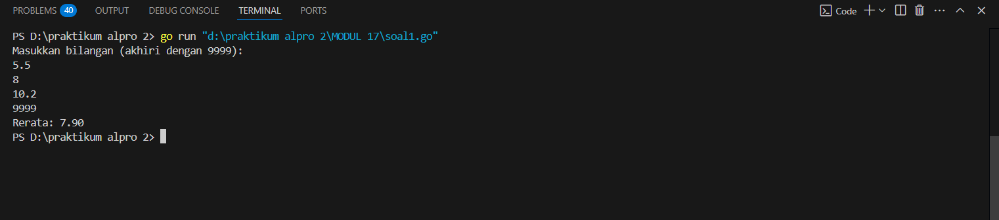
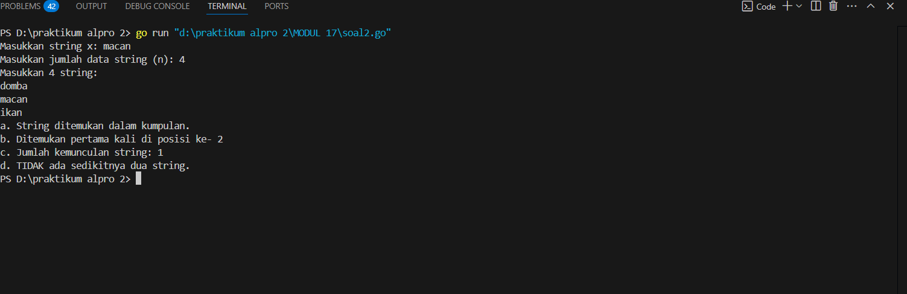
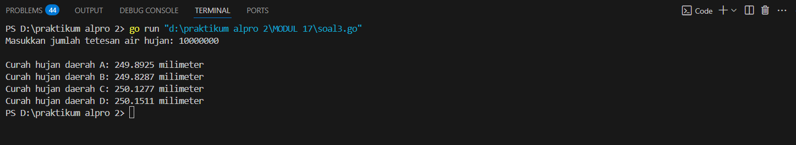
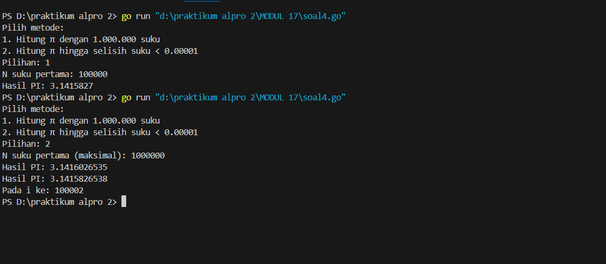
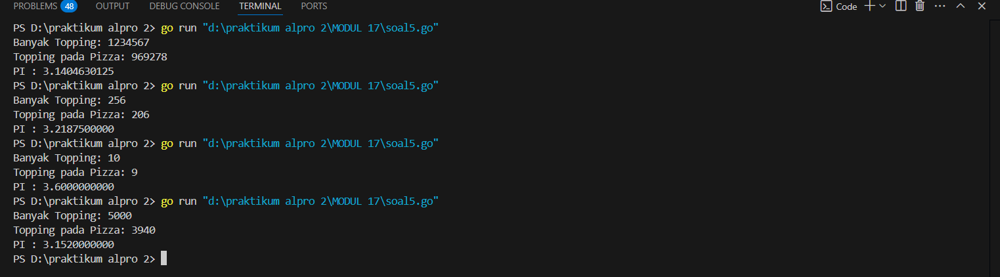

<h1 align="center" > Laporan Praktikum Modul  17 X SKEMA PEMROSESAN SEKUENSIAL</h1>

<p align="center ">Satria Adhi Sadarma - 103112400273<p/>
## soal latihan modul 17


<h1 align="center" > UNGUIDED</h1>

```go
1. package main

  

import (

    "fmt"

)

  

func main() {

    var angka float64

    var total float64

    var count int

  

    fmt.Println("Masukkan bilangan (akhiri dengan 9999):")

    for {

        fmt.Scan(&angka)

        if angka == 9999 {

            break

        }

        total += angka

        count++

    }

  

    if count == 0 {

        fmt.Println("Tidak ada data untuk dihitung.")

    } else {

        rerata := total / float64(count)

        fmt.Printf("Rerata: %.2f\n", rerata)

    }

}
```

output



```go
2. package main

  

import (

    "bufio"

    "fmt"

    "os"

)

  

func main() {

    scanner := bufio.NewScanner(os.Stdin)

  

    fmt.Print("Masukkan string x: ")

    scanner.Scan()

    x := scanner.Text()

  

    fmt.Print("Masukkan jumlah data string (n): ")

    var n int

    fmt.Scan(&n)

  

    stringsList := make([]string, n)

    count := 0

    positions := []int{}

  

    fmt.Println("Masukkan", n, "string:")

    for i := 0; i < n; i++ {

        scanner.Scan()

        input := scanner.Text()

        stringsList[i] = input

  

        if input == x {

            count++

            positions = append(positions, i)

        }

    }

  

    // a. Apakah ada?

    if count > 0 {

        fmt.Println("a. String ditemukan dalam kumpulan.")

    } else {

        fmt.Println("a. String TIDAK ditemukan.")

    }

  

    // b. Posisi pertama

    if count > 0 {

        fmt.Println("b. Ditemukan pertama kali di posisi ke-", positions[0])

    } else {

        fmt.Println("b. Tidak ditemukan, jadi tidak ada posisi.")

    }

  

    // c. Ada berapa?

    fmt.Println("c. Jumlah kemunculan string:", count)

  

    // d. Apakah ada dua atau lebih?

    if count >= 2 {

        fmt.Println("d. Ada sedikitnya dua string yang sama.")

    } else {

        fmt.Println("d. TIDAK ada sedikitnya dua string.")

    }

}
```

output


```go
3. package main

  

import (

    "fmt"

    "math/rand"

)

  

func main() {

    var n int

    fmt.Print("Masukkan jumlah tetesan air hujan: ")

    fmt.Scan(&n)

  

    rand.Seed(1)

  

    countA, countB, countC, countD := 0, 0, 0, 0

  

    for i := 0; i < n; i++ {

        x := rand.Float64()

        y := rand.Float64()

  

        if x < 0.5 && y < 0.5 {

            countA++

        } else if x >= 0.5 && y < 0.5 {

            countB++

        } else if x >= 0.5 && y >= 0.5 {

            countC++

        } else {

            countD++

        }

    }

  
  

    dropVolume := 0.0001

  

    rainA := float64(countA) * dropVolume

    rainB := float64(countB) * dropVolume

    rainC := float64(countC) * dropVolume

    rainD := float64(countD) * dropVolume

  

    fmt.Printf("\nCurah hujan daerah A: %.4f milimeter\n", rainA)

    fmt.Printf("Curah hujan daerah B: %.4f milimeter\n", rainB)

    fmt.Printf("Curah hujan daerah C: %.4f milimeter\n", rainC)

    fmt.Printf("Curah hujan daerah D: %.4f milimeter\n", rainD)

}
```

output


```go
4. package main

  

import (

    "fmt"

    "math"

)

  

func main() {

    var choice int

    fmt.Println("Pilih metode:")

    fmt.Println("1. Hitung π dengan 1.000.000 suku")

    fmt.Println("2. Hitung π hingga selisih suku < 0.00001")

    fmt.Print("Pilihan: ")

    fmt.Scan(&choice)

  

    switch choice {

    case 1:

        calculateFixedTerms()

    case 2:

        calculateUntilConvergence()

    default:

        fmt.Println("Pilihan tidak valid")

    }

}

  

// Versi 1: Menghitung π dengan jumlah suku tetap (1.000.000)

func calculateFixedTerms() {

    var n int

    fmt.Print("N suku pertama: ")

    fmt.Scan(&n)

  

    sum := 0.0

    for i := 1; i <= n; i++ {

        term := math.Pow(-1, float64(i+1)) / (2*float64(i) - 1)

        sum += term

    }

    pi := 4 * sum

    fmt.Printf("Hasil PI: %.7f\n", pi)

}

  

// Versi 2: Menghitung π hingga selisih suku berurutan < 0.00001

func calculateUntilConvergence() {

    var n int

    fmt.Print("N suku pertama (maksimal): ")

    fmt.Scan(&n)

  

    sum := 0.0

    prevTerm := 0.0

    currentTerm := 0.0

    i := 1

    converged := false

  

    for ; i <= n; i++ {

        currentTerm = math.Pow(-1, float64(i+1)) / (2*float64(i) - 1)

        sum += currentTerm

  

        // Cek selisih setelah suku kedua

        if i > 1 {

            if math.Abs(currentTerm-prevTerm) <= 0.00001 {

                converged = true

                break

            }

        }

        prevTerm = currentTerm

    }

  

    pi1 := 4 * (sum - currentTerm) // π sebelum suku terakhir

    pi2 := 4 * sum                  // π termasuk suku terakhir

  

    fmt.Printf("Hasil PI: %.10f\n", pi1)

    fmt.Printf("Hasil PI: %.10f\n", pi2)

    fmt.Printf("Pada i ke: %d\n", i)

  

    if !converged {

        fmt.Println("Konvergensi tidak tercapai dalam jumlah suku yang diberikan")

    }

}
```

output


```go
5. package main

  

import (

    "fmt"

    "math/rand"

)

  

func main() {

    var totalTopping int

    fmt.Print("Banyak Topping: ")

    fmt.Scanln(&totalTopping)

  

    // Gunakan seed tetap agar hasil konsisten (untuk pengujian)

    rand.Seed(12345)

  

    toppingDalamPizza := 0

  

    for i := 0; i < totalTopping; i++ {

        x := rand.Float64() // 0 <= x < 1

        y := rand.Float64()

  

        // Cek apakah titik berada di dalam lingkaran dengan pusat (0.5, 0.5) dan jari-jari 0.5

        dx := x - 0.5

        dy := y - 0.5

        if dx*dx+dy*dy <= 0.25 {

            toppingDalamPizza++

        }

    }

  

    // Estimasi nilai pi

    pi := 4.0 * float64(toppingDalamPizza) / float64(totalTopping)

  

    // Output

    fmt.Printf("Topping pada Pizza: %d\n", toppingDalamPizza)

    fmt.Printf("PI : %.10f\n", pi)

}
```

output


