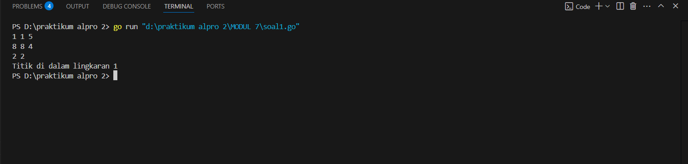
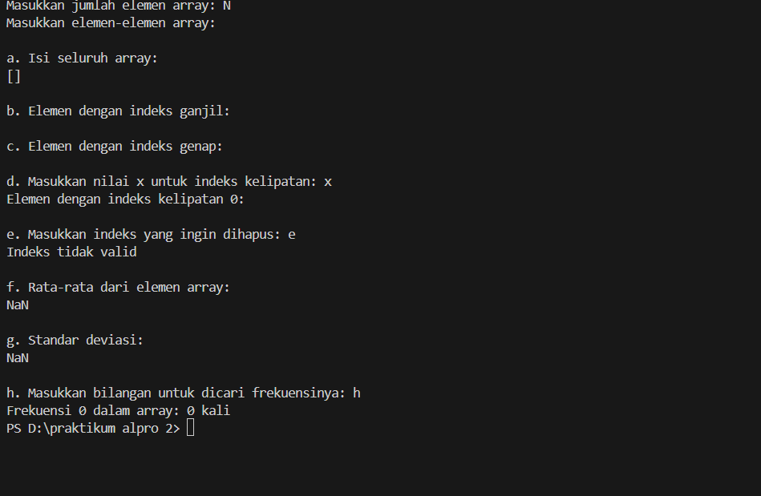
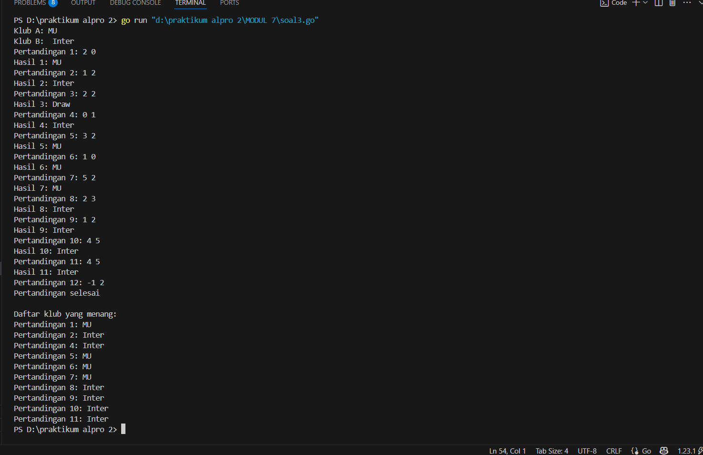
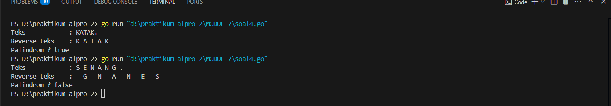

<h1 align="center" > Laporan Praktikum Modul 7 X STRUCT & ARRAY</h1>
<p align="center ">Satria Adhi Sadarma - 103112400273<p/>
## soal latihan modul 2A

soal 1
```go
package main

  

import (

    "fmt"

    "math"

)

  
  

type Titik struct {

    x, y int

}

  
  

type Lingkaran struct {

    titikPusat Titik

    radius     int

}

  
  

func jarak(p, q Titik) float64 {

    return math.Sqrt(math.Pow(float64(p.x-q.x), 2) + math.Pow(float64(p.y-q.y), 2))

}

  
  

func didalam(c Lingkaran, p Titik) bool {

    return jarak(c.titikPusat, p) <= float64(c.radius)

}

  

func main() {

    var cx1, cy1, r1 int

    var cx2, cy2, r2 int

    var x, y int

  

    fmt.Scan(&cx1, &cy1, &r1)

    fmt.Scan(&cx2, &cy2, &r2)

    fmt.Scan(&x, &y)

  

    ling1 := Lingkaran{Titik{cx1, cy1}, r1}

    ling2 := Lingkaran{Titik{cx2, cy2}, r2}

    titik := Titik{x, y}

  

    dalam1 := didalam(ling1, titik)

    dalam2 := didalam(ling2, titik)

  
  

    if dalam1 && dalam2 {

        fmt.Println("Titik di dalam lingkaran 1 dan 2")

    } else if dalam1 {

        fmt.Println("Titik di dalam lingkaran 1")

    } else if dalam2 {

        fmt.Println("Titik di dalam lingkaran 2")

    } else {

        fmt.Println("Titik di luar lingkaran 1 dan 2")

    }

}


```

output


soal 2
```go
package main

  

import (

    "fmt"

    "math"

)

  
  

func rataRata(arr []int) float64 {

    total := 0

    for _, val := range arr {

        total += val

    }

    return float64(total) / float64(len(arr))

}

  
  

func standarDeviasi(arr []int) float64 {

    rata := rataRata(arr)

    var total float64

    for _, val := range arr {

        total += math.Pow(float64(val)-rata, 2)

    }

    return math.Sqrt(total / float64(len(arr)))

}

  
  

func frekuensi(arr []int, target int) int {

    count := 0

    for _, val := range arr {

        if val == target {

            count++

        }

    }

    return count

}

  

func main() {

    var n int

    fmt.Print("Masukkan jumlah elemen array: ")

    fmt.Scan(&n)

  

    arr := make([]int, 0, n)

    fmt.Println("Masukkan elemen-elemen array:")

    for i := 0; i < n; i++ {

        var num int

        fmt.Printf("Elemen ke-%d: ", i)

        fmt.Scan(&num)

        arr = append(arr, num)

    }

  
  

    fmt.Println("\na. Isi seluruh array:")

    fmt.Println(arr)

  

    fmt.Println("\nb. Elemen dengan indeks ganjil:")

    for i := 1; i < len(arr); i += 2 {

        fmt.Printf("Index %d: %d\n", i, arr[i])

    }

  
  

    fmt.Println("\nc. Elemen dengan indeks genap:")

    for i := 0; i < len(arr); i += 2 {

        fmt.Printf("Index %d: %d\n", i, arr[i])

    }

  

    var x int

    fmt.Print("\nd. Masukkan nilai x untuk indeks kelipatan: ")

    fmt.Scan(&x)

    fmt.Printf("Elemen dengan indeks kelipatan %d:\n", x)

    for i := 0; i < len(arr); i++ {

        if i%x == 0 {

            fmt.Printf("Index %d: %d\n", i, arr[i])

        }

    }

  
  

    var indexHapus int

    fmt.Print("\ne. Masukkan indeks yang ingin dihapus: ")

    fmt.Scan(&indexHapus)

    if indexHapus >= 0 && indexHapus < len(arr) {

        arr = append(arr[:indexHapus], arr[indexHapus+1:]...)

        fmt.Println("Isi array setelah penghapusan:")

        fmt.Println(arr)

    } else {

        fmt.Println("Indeks tidak valid")

    }

  

    fmt.Println("\nf. Rata-rata dari elemen array:")

    fmt.Printf("%.2f\n", rataRata(arr))

  

    fmt.Println("\ng. Standar deviasi:")

    fmt.Printf("%.2f\n", standarDeviasi(arr))

  

    var target int

    fmt.Print("\nh. Masukkan bilangan untuk dicari frekuensinya: ")

    fmt.Scan(&target)

    fmt.Printf("Frekuensi %d dalam array: %d kali\n", target, frekuensi(arr, target))

}
```

output


soal 3
```go
package main

  

import (

    "fmt"

)

  

func main() {

    var klubA, klubB string

    var skorA, skorB int

    var pemenang []string

  
  

    fmt.Print("Klub A: ")

    fmt.Scanln(&klubA)

    fmt.Print("Klub B: ")

    fmt.Scanln(&klubB)

  

    pertandingan := 1

  

    for {

        fmt.Printf("Pertandingan %d: ", pertandingan)

        fmt.Scan(&skorA, &skorB)

  

        if skorA < 0 || skorB < 0 {

            break

        }

  

        if skorA > skorB {

            pemenang = append(pemenang, klubA)

            fmt.Printf("Hasil %d: %s\n", pertandingan, klubA)

        } else if skorB > skorA {

            pemenang = append(pemenang, klubB)

            fmt.Printf("Hasil %d: %s\n", pertandingan, klubB)

        } else {

            pemenang = append(pemenang, "Draw")

            fmt.Printf("Hasil %d: Draw\n", pertandingan)

        }

        pertandingan++

    }

  

    fmt.Println("Pertandingan selesai")

  

    fmt.Println("\nDaftar klub yang menang:")

    for i, p := range pemenang {

        if p != "Draw" {

            fmt.Printf("Pertandingan %d: %s\n", i+1, p)

        }

    }

}
```

output


soal 4
```go
package main

  

import (

    "fmt"

)

  

const NMAX int = 127

  

type tabel [NMAX]rune

  

func isiArray(t *tabel, n *int) {

    var c rune

    *n = 0

    for {

        fmt.Scanf("%c", &c)

        if c == '\n' {

            continue

        }

        if c == '.' {

            break

        }

        t[*n] = c

        *n++

    }

}

  
  

func cetakArray(t tabel, n int) {

    for i := 0; i < n; i++ {

        fmt.Printf("%c ", t[i])

    }

    fmt.Println()

}

  
  

func balikanArray(t *tabel, n int) {

    for i := 0; i < n/2; i++ {

        t[i], t[n-1-i] = t[n-1-i], t[i]

    }

}

  
  

func palindrom(t tabel, n int) bool {

    var temp tabel

    for i := 0; i < n; i++ {

        temp[i] = t[i]

    }

  

    balikanArray(&temp, n)

  

    for i := 0; i < n; i++ {

        if temp[i] != t[i] {

            return false

        }

    }

    return true

}

  

func main() {

    var tab tabel

    var m int

  

    fmt.Print("Teks\t\t: ")

    isiArray(&tab, &m)

  

    fmt.Print("Reverse teks\t: ")

    var tabCopy tabel

    copy(tabCopy[:], tab[:m])

    balikanArray(&tabCopy, m)

    cetakArray(tabCopy, m)

  

    fmt.Print("Palindrom ? ")

    if palindrom(tab, m) {

        fmt.Println("true")

    } else {

        fmt.Println("false")

    }

}
```

output
