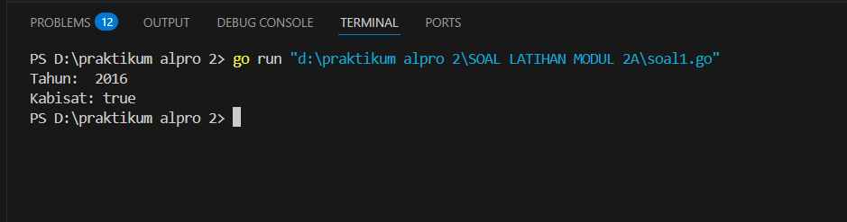
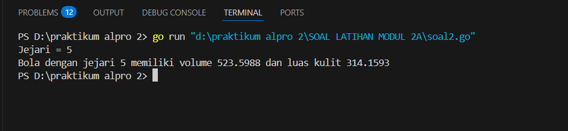
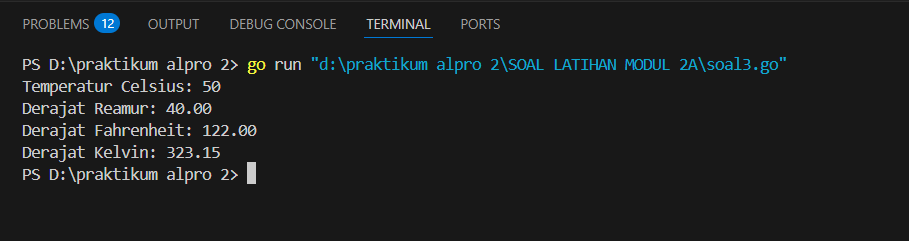
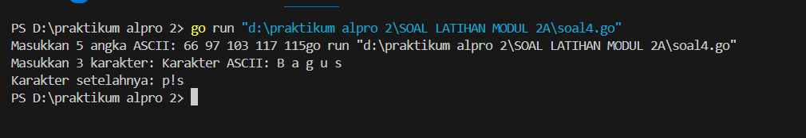
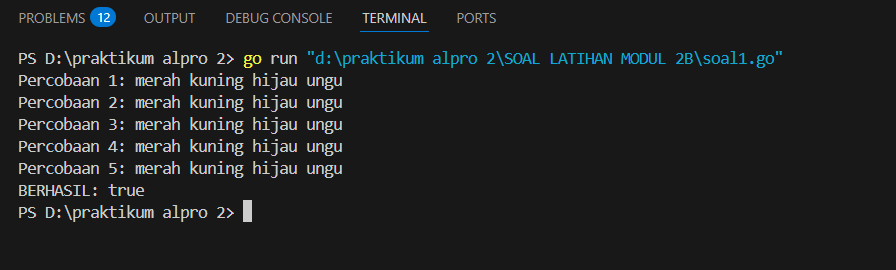
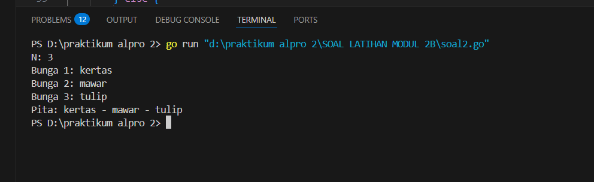
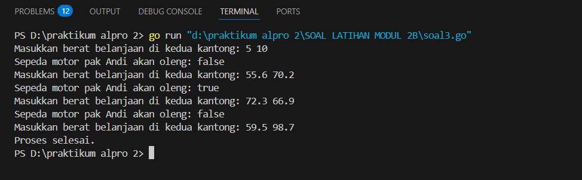
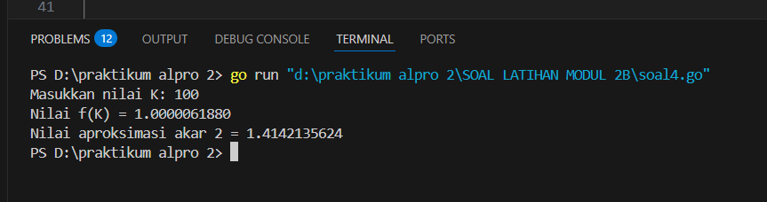
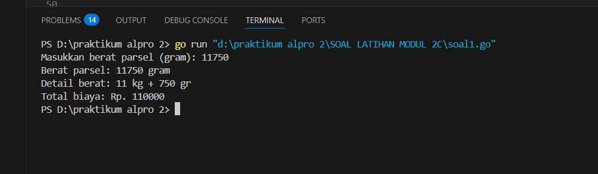
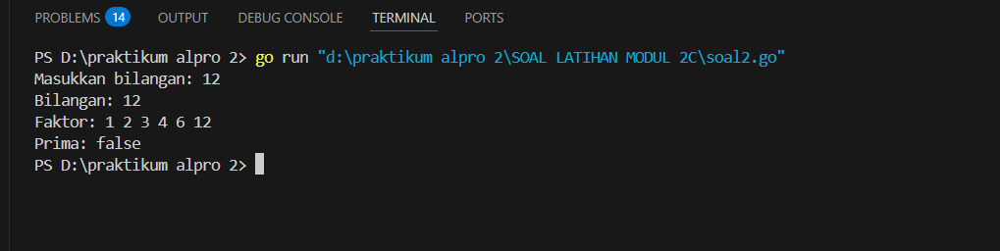

<h1 align="center" > Laporan Praktikum Modul 2 X Review Pengenalan Pemrograman</h1>


<p align="center ">Satria Adhi Sadarma - 103112400273<p/>
## soal latihan modul 2A

soal 1


```go
package main

  

import (

    "fmt"

)

  

func main() {

    expected := [4]string{"merah", "kuning", "hijau", "ungu"}

    var percobaan [5][4]string

    berhasil := true

  

    for i := 0; i < 5; i++ {

        fmt.Printf("Percobaan %d: ", i+1)

        for j := 0; j < 4; j++ {

            fmt.Scan(&percobaan[i][j])

        }

    }

  
  

    for i := 0; i < 5; i++ {

        for j := 0; j < 4; j++ {

            if percobaan[i][j] != expected[j] {

                berhasil = false

                break

            }

        }

        if !berhasil {

            break

        }

    }

  

    fmt.Println("BERHASIL:", berhasil)

}
```

output



soal 2
```go
package main

  

import (

    "fmt"

    "math"

)

  

func main() {

    var r float64

    fmt.Print("Jejari = ")

    fmt.Scan(&r)

  

    const pi = 3.1415926535

  

    volume := (4.0 / 3.0) * pi * math.Pow(r, 3)

    luas := 4 * pi * math.Pow(r, 2)

  

    fmt.Printf("Bola dengan jejari %.0f memiliki volume %.4f dan luas kulit %.4f\n", r, volume, luas)

}
```

output


soal 3
```go
package main

  

import (

    "fmt"

)

  

func main() {

    var celsius float64

  

    fmt.Print("Temperatur Celsius: ")

    fmt.Scan(&celsius)

  

    reamur := (4.0 / 5.0) * celsius

    fahrenheit := (9.0 / 5.0 * celsius) + 32

    kelvin := celsius + 273.15

  

    fmt.Printf("Derajat Reamur: %.2f\n", reamur)

    fmt.Printf("Derajat Fahrenheit: %.2f\n", fahrenheit)

    fmt.Printf("Derajat Kelvin: %.2f\n", kelvin)

}
```

output


soal 4
```go
package main

  

import (

    "fmt"

)

  

func main() {

    var asciiValues [5]int

    var chars [3]rune

  

    for i := 0; i < 5; i++ {

        fmt.Scan(&asciiValues[i])

    }

  

    for i := 0; i < 3; i++ {

        fmt.Scanf("%c", &chars[i])

    }

  
  

    for i := 0; i < 5; i++ {

        fmt.Printf("%c", asciiValues[i])

    }

    fmt.Println()

  

    for i := 0; i < 3; i++ {

        fmt.Printf("%c", chars[i]+1)

    }

    fmt.Println()

}
```

output


## soal latihan modul 2B

soal 1
```go
package main

  

import (

    "fmt"

)

  

func main() {

    expected := [4]string{"merah", "kuning", "hijau", "ungu"}

    var percobaan [5][4]string

    berhasil := true

  

    for i := 0; i < 5; i++ {

        fmt.Printf("Percobaan %d: ", i+1)

        for j := 0; j < 4; j++ {

            fmt.Scan(&percobaan[i][j])

        }

    }

  
  

    for i := 0; i < 5; i++ {

        for j := 0; j < 4; j++ {

            if percobaan[i][j] != expected[j] {

                berhasil = false

                break

            }

        }

        if !berhasil {

            break

        }

    }

  

    fmt.Println("BERHASIL:", berhasil)

}
```

output


soal 2
```go
package main

  

  

import "fmt"

  

  

func main() {

  

    var n int

  

    fmt.Print("N: ")

  

    fmt.Scan(&n)

  

  

    var pita string

  

    for i := 0; i < n; i++ {

  

        var bunga string

  

        fmt.Printf("Bunga %d: ", i+1)

  

        fmt.Scan(&bunga)

  

  

        if i == 0 {

  

            pita = bunga

  

        } else {

  

            pita += " - " + bunga

  

        }

  

    }

  

  

    fmt.Println("Pita:", pita)

  

}
```

output


soal 3

```go
 package main

  

import (

    "fmt"

    "math"

)

  

func main() {

    for {

        var berat1, berat2 float64

  

        fmt.Print("Masukkan berat belanjaan di kedua kantong: ")

        _, err := fmt.Scan(&berat1, &berat2)

        if err != nil {

            fmt.Println("Input tidak valid. Silakan masukkan angka.")

            continue

        }

  

        if berat1 < 0 || berat2 < 0 || (berat1+berat2) > 150 {

            fmt.Println("Proses selesai.")

            break

        }

  

        selisih := math.Abs(berat1 - berat2)

        motorOleng := selisih >= 9

  

        fmt.Printf("Sepeda motor pak Andi akan oleng: %t\n", motorOleng)

    }

}
```

output


soal 4
```go
package main

  

  

import "fmt"

  

  

func calculateF(k int) float64 {

  

    return float64((4*k + 2) * (4*k + 2)) / float64((4*k + 1) * (4*k + 3))

  

}

  

  

func approximateSqrt2(k int) float64 {

  

    result := 1.0

  

    for i := 0; i < k; i++ {

  

        result = (result + 2/result) / 2

  

    }

  

    return result

  

}

  

  

func main() {

  

    var k int

  

    fmt.Print("Masukkan nilai K: ")

  

    fmt.Scan(&k)

  

  

    fK := calculateF(k)

  

    fmt.Printf("Nilai f(K) = %.10f\n", fK)

  

  

    sqrt2 := approximateSqrt2(k)

  

    fmt.Printf("Nilai aproksimasi akar 2 = %.10f\n", sqrt2)

  

}
```

output


## soal latihan modul 2C


soal 1
```go
package main

  

import (

    "fmt"

)

  

func hitungBiayaPengiriman(beratGram int) int {

    kg := beratGram / 1000

    sisaGram := beratGram % 1000

  

    biaya := kg * 10000

  

    if kg >= 10 {

        sisaGram = 0

    }

  

    if sisaGram >= 500 {

        biaya += sisaGram * 5

    } else {

        biaya += sisaGram * 15

    }

  

    return biaya

}

  

func main() {

    var berat int

  

    fmt.Print("Masukkan berat parsel (gram): ")

    _, err := fmt.Scan(&berat)

    if err != nil || berat <= 0 {

        fmt.Println("Input tidak valid. Masukkan berat dalam gram sebagai bilangan positif.")

        return

    }

  
  

    biaya := hitungBiayaPengiriman(berat)

  

    kg := berat / 1000

    sisaGram := berat % 1000

  

    fmt.Printf("Berat parsel: %d gram\n", berat)

    fmt.Printf("Detail berat: %d kg + %d gr\n", kg, sisaGram)

    fmt.Printf("Total biaya: Rp. %d\n", biaya)

}
```

output


soal 2
```go
package main

  

import (

    "fmt"

)

  
  

func cariFaktor(b int) []int {

    var faktor []int

    for i := 1; i <= b; i++ {

        if b%i == 0 {

            faktor = append(faktor, i)

        }

    }

    return faktor

}

  
  

func isPrima(b int) bool {

    if b < 2 {

        return false

    }

    count := 0

    for i := 1; i <= b; i++ {

        if b%i == 0 {

            count++

        }

    }

    return count == 2

}

  

func main() {

    var b int

  

    fmt.Print("Masukkan bilangan: ")

    fmt.Scan(&b)

  

    if b > 0 {

        faktor := cariFaktor(b)

        prima := isPrima(b)

  

        fmt.Printf("Bilangan: %d\n", b)

        fmt.Print("Faktor: ")

        for _, f := range faktor {

            fmt.Printf("%d ", f)

        }

        fmt.Println()

  

        fmt.Printf("Prima: %t\n", prima)

    } else {

        fmt.Println("Bilangan harus lebih dari 0!")

    }

}
```
 output
 
 