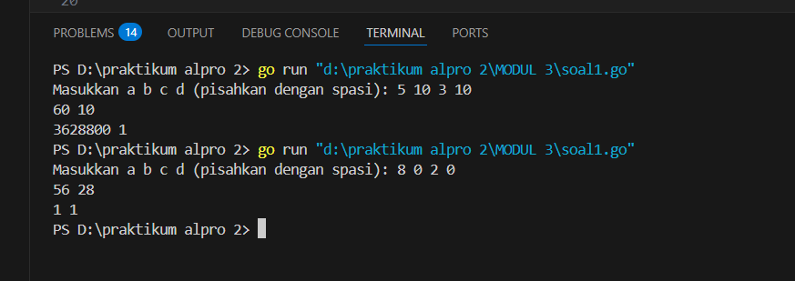
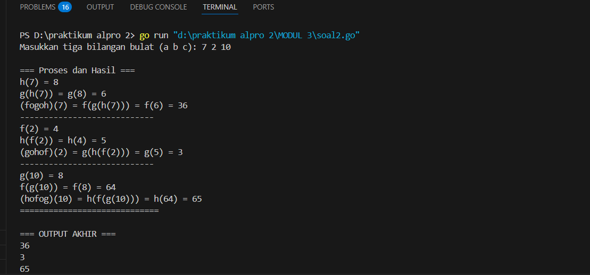
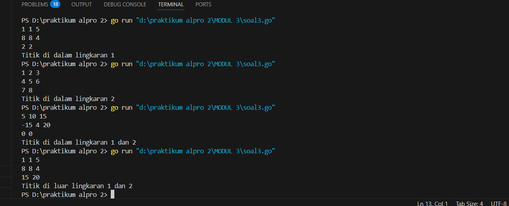

<h1 align="center" > Laporan Praktikum Modul 3 X Fungsi</h1>


<p align="center ">Satria Adhi Sadarma - 103112400273<p/>
## soal latihan modul 3

soal 1
```go
package main

  

import (

    "fmt"

)

  
  

func factorial(n int) int {

    hasil := 1

    for i := 2; i <= n; i++ {

        hasil *= i

    }

    return hasil

}

  
  

func permutation(n, r int) int {

    return factorial(n) / factorial(n - r)

}

  
  

func combination(n, r int) int {

    return factorial(n) / (factorial(r) * factorial(n - r))

}

  

func main() {

    var a, b, c, d int

  

    fmt.Print("Masukkan a b c d (pisahkan dengan spasi): ")

    fmt.Scan(&a, &b, &c, &d)

  

    if a < c || b < d {

        fmt.Println("Input tidak memenuhi syarat! (a >= c dan b >= d)")

        return

    }

  

    p1 := permutation(a, c)

    c1 := combination(a, c)

  

    p2 := permutation(b, d)

    c2 := combination(b, d)

  

    fmt.Printf("%d %d\n", p1, c1)

    fmt.Printf("%d %d\n", p2, c2)

}
```

output



soal 2
```go
package main

  

import (

    "fmt"

)

  
  

func f(x int) int {

    return x * x

}

  
  

func g(x int) int {

    return x - 2

}

  
  

func h(x int) int {

    return x + 1

}

  

func main() {

    var a, b, c int

  

    fmt.Print("Masukkan tiga bilangan bulat (a b c): ")

    fmt.Scan(&a, &b, &c)

  

    fmt.Println("\n=== Proses dan Hasil ===")

  

    h_a := h(a)

    fmt.Printf("h(%d) = %d\n", a, h_a)

    g_h_a := g(h_a)

    fmt.Printf("g(h(%d)) = g(%d) = %d\n", a, h_a, g_h_a)

    f_g_h_a := f(g_h_a)

    fmt.Printf("(fogoh)(%d) = f(g(h(%d))) = f(%d) = %d\n", a, a, g_h_a, f_g_h_a)

  

    fmt.Println("----------------------------")

  
  

    f_b := f(b)

    fmt.Printf("f(%d) = %d\n", b, f_b)

    h_f_b := h(f_b)

    fmt.Printf("h(f(%d)) = h(%d) = %d\n", b, f_b, h_f_b)

    g_h_f_b := g(h_f_b)

    fmt.Printf("(gohof)(%d) = g(h(f(%d))) = g(%d) = %d\n", b, b, h_f_b, g_h_f_b)

  

    fmt.Println("----------------------------")

  

    g_c := g(c)

    fmt.Printf("g(%d) = %d\n", c, g_c)

    f_g_c := f(g_c)

    fmt.Printf("f(g(%d)) = f(%d) = %d\n", c, g_c, f_g_c)

    h_f_g_c := h(f_g_c)

    fmt.Printf("(hofog)(%d) = h(f(g(%d))) = h(%d) = %d\n", c, c, f_g_c, h_f_g_c)

  

    fmt.Println("=============================")

    fmt.Println("\n=== OUTPUT AKHIR ===")

    fmt.Println(f_g_h_a)  

    fmt.Println(g_h_f_b)  

    fmt.Println(h_f_g_c)  

}
```

output



soal 3
```go
package main

  

import (

    "fmt"

    "math"

)

  
  

func jarak(a, b, c, d float64) float64 {

    return math.Sqrt(math.Pow(a-c, 2) + math.Pow(b-d, 2))

}

  
  

func didalam(cx, cy, r, x, y float64) bool {

    return jarak(cx, cy, x, y) <= r

}

  

func main() {

    var cx1, cy1, r1 float64

    var cx2, cy2, r2 float64

    var x, y float64

  

    fmt.Scan(&cx1, &cy1, &r1)

    fmt.Scan(&cx2, &cy2, &r2)

    fmt.Scan(&x, &y)

  
  

    dalamLingkaran1 := didalam(cx1, cy1, r1, x, y)

    dalamLingkaran2 := didalam(cx2, cy2, r2, x, y)

  

    if dalamLingkaran1 && dalamLingkaran2 {

        fmt.Println("Titik di dalam lingkaran 1 dan 2")

    } else if dalamLingkaran1 {

        fmt.Println("Titik di dalam lingkaran 1")

    } else if dalamLingkaran2 {

        fmt.Println("Titik di dalam lingkaran 2")

    } else {

        fmt.Println("Titik di luar lingkaran 1 dan 2")

    }

}
```

output
