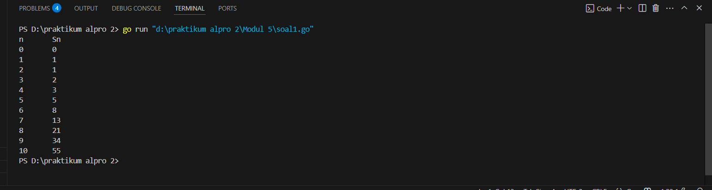
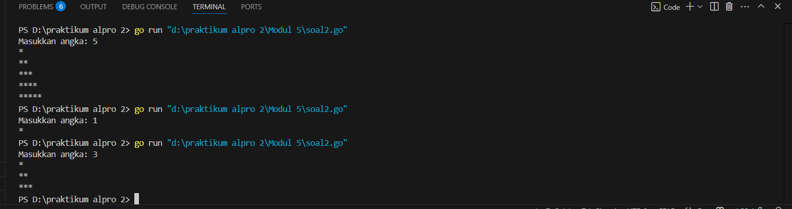
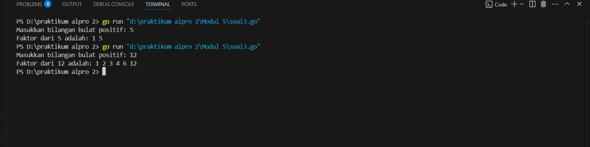
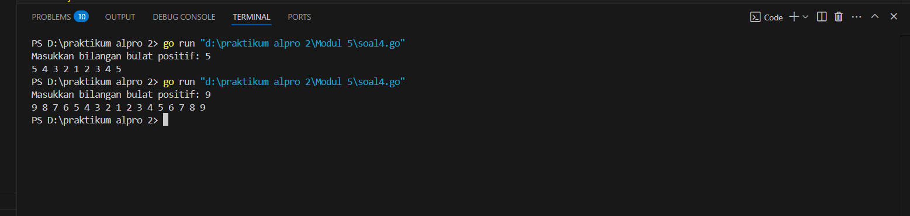
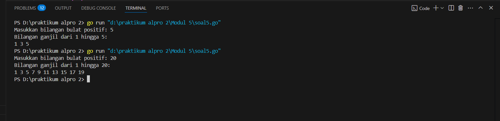
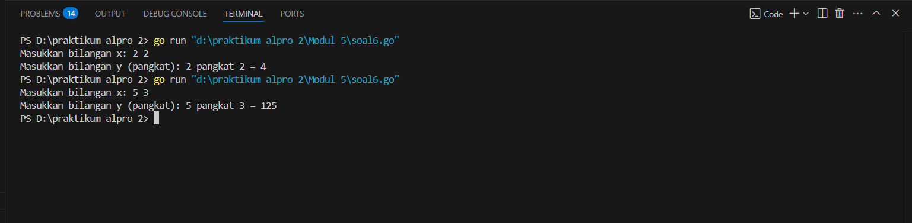

<h1 align="center" > Laporan Praktikum Modul 5 X Rekursif</h1>

<p align="center ">Satria Adhi Sadarma - 103112400273<p/>
## soal latihan modul 5

soal 1
```go
package main

import "fmt"

  
  

func fibonacci(n int) int {

    if n == 0 {

        return 0

    } else if n == 1 {

        } else if n == 1 {

        return 1

    } else {

        return fibonacci(n-1) + fibonacci(n-2)

    }

}

  

func main() {

    fmt.Println("n\tSn")

    for i := 0; i <= 10; i++ {

        fmt.Printf("%d\t%d\n", i, fibonacci(i))

    }

}
```

output


soal 2
```go
package main

  

import (

    "fmt"

)

  
  

func printStars(n int) {

    if n == 0 {

        return

    }

    fmt.Print("*")

    printStars(n - 1)

}

  
  

func printPattern(n int, current int) {

    if current > n {

        return

    }

    printStars(current)

    fmt.Println()

    printPattern(n, current+1)

}

  

func main() {

    var N int

    fmt.Print("Masukkan angka: ")

    fmt.Scan(&N)

  

    printPattern(N, 1)

}
```

output


soal 3
```go
package main

  

import (

    "fmt"

)

  
  

func cetakFaktor(n int, i int) {

    if i > n {

        return

    }

  

    if n%i == 0 {

        fmt.Printf("%d ", i)

    }

  

    cetakFaktor(n, i+1)

}

  

func main() {

    var N int

    fmt.Print("Masukkan bilangan bulat positif: ")

    fmt.Scan(&N)

  

    fmt.Printf("Faktor dari %d adalah: ", N)

    cetakFaktor(N, 1)

    fmt.Println()
```

output


soal 4
```go
package main

  

import (

    "fmt"

)

  
  

func printDescending(n int) {

    if n < 1 {

        return

    }

    fmt.Printf("%d ", n)

    printDescending(n - 1)

}

  
  

func printAscending(n int, current int) {

    if current > n {

        return

    }

    fmt.Printf("%d ", current)

    printAscending(n, current+1)

}

  

func main() {

    var N int

    fmt.Print("Masukkan bilangan bulat positif: ")

    fmt.Scan(&N)

  
  

    printDescending(N)

    printAscending(N, 2)

  

    fmt.Println()

}
```

output


soal 5 
```go
package main

  

import (

    "fmt"

)

  
  

func printOdd(n int, current int) {

    if current > n {

        return

    }

  

    fmt.Printf("%d ", current)

    printOdd(n, current+2)

}

  

func main() {

    var N int

    fmt.Print("Masukkan bilangan bulat positif: ")

    fmt.Scan(&N)

  

    fmt.Printf("Bilangan ganjil dari 1 hingga %d:\n", N)

    printOdd(N, 1)

    fmt.Println()

}
```

output


soal 6
```go
package main

  

import (

    "fmt"

)

  
  

func power(x int, y int) int {

    if y == 0 {

        return 1

    }

    return x * power(x, y-1)

}

  

func main() {

    var x, y int

    fmt.Print("Masukkan bilangan x: ")

    fmt.Scan(&x)

    fmt.Print("Masukkan bilangan y (pangkat): ")

    fmt.Scan(&y)

  

    hasil := power(x, y)

    fmt.Printf("%d pangkat %d = %d\n", x, y, hasil)

}
```
 output
 
 